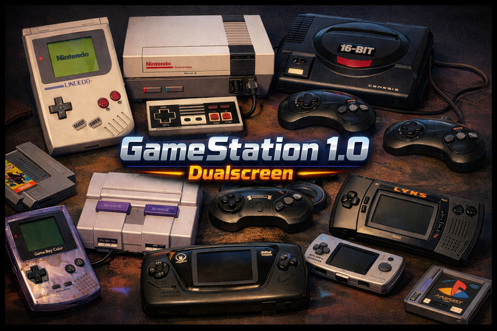
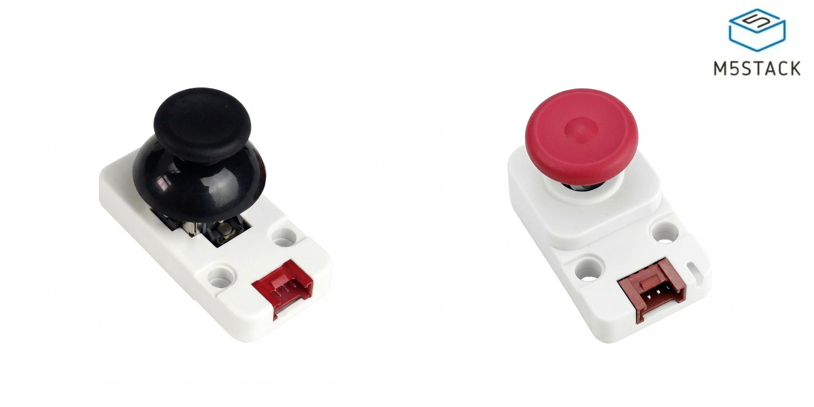

# CardputerGBC-Dual



CardputerGBC-Dual is a dual-screen emulator firmware for the M5Stack Cardputer.
This branch focuses on MSX/MSX1 and ColecoVision support, with selectable output
on the internal Cardputer LCD or on an external SPI TFT display.

Version 0.2 adds a dual-core MSX runtime, an embedded C-BIOS fallback, a
ColecoVision emulator, save states, fast save/load shortcuts, SD reliability
improvements, and indexed ROM browsing for large SD card collections.

The project started from the excellent work in
[Cardputer-Game-Station-Emulators](https://github.com/geo-tp/Cardputer-Game-Station-Emulators)
by /u/geo-tp, and keeps adapting the firmware around the Cardputer hardware.

## Version 0.2 Highlights

- MSX/MSX1 emulation with a dual-core runtime on ESP32-S3.
- Embedded C-BIOS fallback for MSX ROM loading, suggested by /u/geo-tp.
- Official MSX BIOS support from SD for full BASIC and `.dsk` disk usage.
- `STARTBASIC.ROM` helper ROM for launching MSX BASIC from the ROM selector.
- ColecoVision emulation on internal LCD and external TFT.
- ColecoVision external display output at 60 fps.
- Internal and external display target selection before launch.
- 16-bit and 12-bit external TFT color-depth modes.
- Runtime config menu with save-state slot selection.
- Save/load state support from the runtime menu.
- Fast save and fast load with `Fn + S` and `Fn + L`.
- SD access fixes while the external display is active.
- ROM selector index files for large folders.
- ROM selector refresh option for rebuilding directory indexes.

## Supported Systems

| System | Extensions | Display | Save States | Notes |
| --- | --- | --- | --- | --- |
| MSX/MSX1 cartridge | `.rom`, `.mx1` | Internal LCD or external TFT | Yes | Embedded C-BIOS fallback available |
| MSX disk image | `.dsk` | Internal LCD or external TFT | Yes | Requires official MSX BIOS and Disk ROM |
| MSX BASIC launcher | `STARTBASIC.ROM` | Internal LCD or external TFT | Yes | Requires official MSX BIOS |
| ColecoVision | `.col` | Internal LCD or external TFT | Yes | Requires ColecoVision BIOS on SD |

ROMs must be uncompressed. Do not use `.zip`, `.7z`, or `.rar`.

## MSX Support

The MSX runtime is built around a dual-core architecture:

- the emulation loop runs on one ESP32-S3 core
- VDP/rendering work is pushed to the other core where possible
- external TFT output can run while SD access remains usable

The current release targets MSX/MSX1. MSX2 is not included in v0.2 because the
current Cardputer hardware has no PSRAM. After testing and optimization work,
MSX2 is not realistic on this device without additional RAM.

The MSX2 work is still available in the GitHub repository on the
`msx2-dualcore` branch. If M5Stack releases a Cardputer-like device with PSRAM,
that branch can be resumed.

### MSX BIOS And C-BIOS

The firmware embeds C-BIOS as a fallback BIOS for MSX cartridge ROM loading.
If no valid official `MSX.ROM` is found on the SD card, the loader copies the
embedded C-BIOS from flash to RAM and uses it automatically.

When the fallback is used, the serial log includes a line similar to:

```text
[MSX][BIOS] accept embedded C-BIOS size=32768 md5=...
```

C-BIOS is useful for many cartridge ROMs, but it does not replace the official
MSX BIOS for every use case.

To boot MSX BASIC, use the official MSX BIOS:

```text
/sd/bios/msx/MSX.ROM
```

To boot `.dsk` disk images, also provide:

```text
/sd/bios/msx/DISK.ROM
```

Reference hashes:

```text
MSX.ROM   364a1a579fe5cb8dba54519bcfcdac0d
DISK.ROM  80dcd1ad1a4cf65d64b7ba10504e8190
```

The loader searches the configured BIOS path first, then common SD locations
such as:

```text
/sd/bios/msx/
/sd/msx/
```

### STARTBASIC.ROM

Version 0.2 includes `STARTBASIC.ROM`, a small helper ROM that can be copied to:

```text
/sd/roms/MSX/STARTBASIC.ROM
```

It appears in the ROM selector and lets you start MSX BASIC more conveniently.

`STARTBASIC.ROM` does not replace the official MSX BIOS. To actually boot into
BASIC, you still need:

```text
/sd/bios/msx/MSX.ROM
```

For `.dsk` disk support, you should also provide:

```text
/sd/bios/msx/DISK.ROM
```

Recommended BASIC and disk setup:

```text
/sd/roms/MSX/STARTBASIC.ROM
/sd/bios/msx/MSX.ROM
/sd/bios/msx/DISK.ROM
```

## ColecoVision Support

ColecoVision emulation is implemented in `src/coleco` and supports:

- `.col` cartridge ROMs
- internal Cardputer LCD output
- external SPI TFT output
- 60 fps video output
- 12-bit and 16-bit external TFT modes
- runtime menu integration
- save states
- fast save and fast load

The ColecoVision BIOS is not embedded. Put the official BIOS on the SD card,
for example:

```text
/sd/bios/coleco.rom
/sd/bios/coleco/coleco.rom
```

### ColecoVision Emulator Lineage

The ColecoVision emulator is not a direct port of ColEm, CoolCV, or SMS Plus.

Short version: it uses a fMSX/EMULib foundation by Marat Fayzullin, Z80
adaptation work from the esplay-fMSX area, and a custom ColecoVision core
implemented for this project.

More specifically:

- Z80 CPU: based on the fMSX Z80 engine by Marat Fayzullin, as ported to ESP32
  in esplay-fMSX.
- SN76489 audio: from EMULib by Marat Fayzullin, copyright 1996-1998.
- TMS9918/VDP: local implementation in `src/coleco/core/coleco_vdp.cpp`, with
  some logic and comments inspired by fMSX, especially around Screen 2 and
  addressing behavior.
- ColecoVision memory map, I/O, input, Cardputer video output, save states, SD
  integration, and internal/external display support are custom or adapted
  specifically for CardputerGBC-Dual.

## SD Card Layout

Suggested SD card folders:

```text
/sd/roms/MSX/
/sd/roms/Coleco/
/sd/bios/msx/
/sd/bios/coleco/
```

Useful files:

```text
/sd/roms/MSX/STARTBASIC.ROM
/sd/bios/msx/MSX.ROM
/sd/bios/msx/DISK.ROM
/sd/bios/coleco.rom
```

Save-state files are created automatically in per-system folders on the SD card
and are linked to the ROM filename.

## ROM Selector

The ROM selector supports `.rom`, `.mx1`, `.dsk`, and `.col` files.

Large ROM folders can be slow or unstable to scan directly on embedded hardware,
so the selector now uses index files. Index files are created automatically the
first time you open a ROM directory.

After an index exists, the selector loads the cached file list instead of
rescanning the whole folder every time. This makes navigation much faster and
more reliable with large SD collections.

If you add, remove, or rename ROM files, refresh the index from the selector:

1. Open the ROM selector.
2. Long-press `G0`.
3. Select the refresh index option.

This rebuilds the index for the current ROM directory.

### ROM Selector Controls

- `E` = up
- `Z` = down
- `A` = jump backward by 4 entries
- `D` = jump forward by 4 entries
- hold `A` or `D` = fast repeat scrolling
- `P` or `Enter` = open folder / select ROM
- `K` = go back to parent folder
- typing letters/numbers = filter the list
- `Del` = remove characters from the filter
- long-press `G0` = selector options, including index refresh

On the `RESUME LAST GAME?` prompt:

- `D`, `Right`, or `Enter` = yes
- `A`, `Left`, or `G0` = no

## Display Workflow

- The internal LCD shows the startup splash and supported formats.
- The external TFT shows a dedicated startup screen when connected/enabled.
- Before launching a supported ROM, the firmware asks whether to use the
  internal LCD or the external TFT.
- When the external TFT is selected, the firmware can use 16-bit or 12-bit color
  depth depending on the saved setting.
- Display target and color depth are saved per core in NVS.

## In-Game Controls

### Runtime Menu And Save States

Save states are supported for both MSX and ColecoVision.

During gameplay, long-press `G0` to open the runtime config menu. From there you
can:

- select the active save slot
- save the current state
- load a previous state
- close the menu and return to gameplay

Quick shortcuts are also available:

- `Fn + S` = fast save
- `Fn + L` = fast load

Fast save/load uses the currently selected slot.

### Global Runtime Keys

- short `G0` press during emulation = quit safely and return to the ROM selector
- backtick long press during emulation = quit safely and return to the ROM selector
- `+` / `-` = audio volume
- `[` / `]` = LCD brightness
- `\` = screen mode toggle
- `Fn + Left / Right` = zoom out / zoom in

### Pre-Launch Controls

Before a game starts, the firmware shows the current bindings for the selected
core.

- any normal key starts the game
- long-press `G0` opens the control editor for the current core

Default bindings:

- directions: `E`, `S`, `A`, `D`
- buttons: `K`, `L`
- `Start`: `1`
- `Select`: `2`

## SD Reliability

SD initialization and access are tuned for the shared hardware constraints:

- the SPI bus is reset before mounting
- CS is forced high before init
- mount retries use several SPI speeds, from 40 MHz down to 1 MHz
- root directory access is verified after mount
- external display writes are paused when needed so SD transfers can complete

## Flash Layouts

The recommended release environment is:

```text
m5stack-stamps3-max-spiffs
```

It currently uses the 8 MB partition table configured in `platformio.ini`.

Layout:

- app partition: `0x340000` bytes
- ROM partition (`spiffs`): `0x4B0000` bytes

The older launcher-driven runtime repartitioning flow is disabled in this
branch. Partition layout is chosen at build/flash time.

## Build And Flash

Recommended build:

```powershell
C:\Users\user\.platformio\penv\Scripts\platformio.exe run --environment m5stack-stamps3-max-spiffs
```

The merged flashable image is stored at:

```text
release/CardputerGBC-Dual-max-spiffs-flashable.bin
```

Important: when regenerating the merged image manually, keep the bootloader
flash mode as `DIO`. Do not force `QIO`.

Example flash command:

```powershell
C:\Users\user\.platformio\penv\Scripts\python.exe -X utf8 C:\Users\user\.platformio\packages\tool-esptoolpy\esptool.py --chip esp32s3 --port COM4 --baud 921600 write_flash 0x0 release\CardputerGBC-Dual-max-spiffs-flashable.bin
```

## Acknowledgements

Thanks to:

- /u/geo-tp for the Cardputer Game Station emulator work and for suggesting the
  C-BIOS fallback path.
- Marat Fayzullin for fMSX and EMULib.
- the esplay-fMSX project for ESP32-oriented fMSX/Z80 adaptation work.
- M5Stack and the Cardputer community for testing and feedback.

## M5Stack Joystick

You can use the M5Stack Joystick v1.1 (U024-C) or Joystick2 (U024-V2). Plug it
in before launching a game and it will be detected automatically.



## D-Pad 3D Model

[Cardputer-Accessories repo](https://github.com/AndreiVladescu/Cardputer-Accessories)
contains a printable D-Pad model that fits the Cardputer keyboard. Thanks to
@AndreiVladescu.

[](https://github.com/AndreiVladescu/Cardputer-Accessories)
